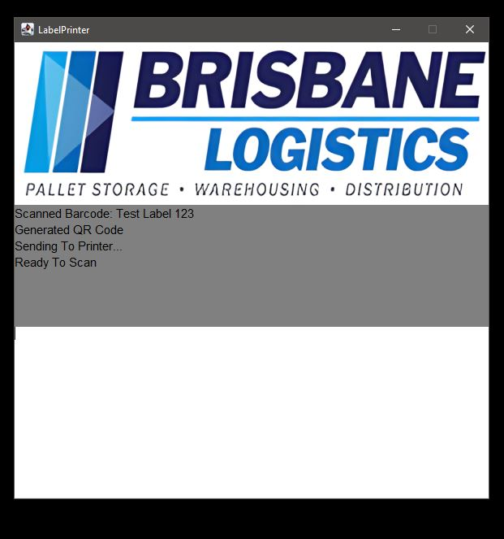
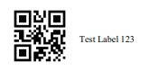

# Label Printer
IntelliJ Java Label Printer made for warehouse usage. Takes input from a label scanner and instantly prints a label of fixed size (50mm x 25mm) on the system default printer. The label is formatted with a QR code, and the scanned text next to it. Can also type desired input and press Enter. Maven used to import dependencies.

#### Program GUI

#### Printed Result

